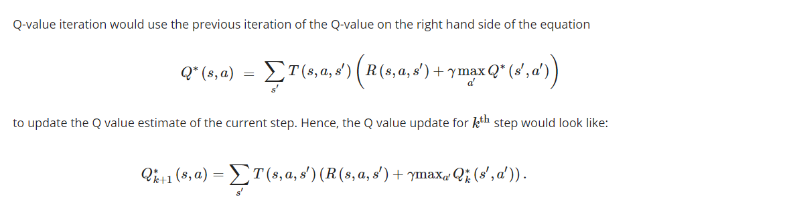
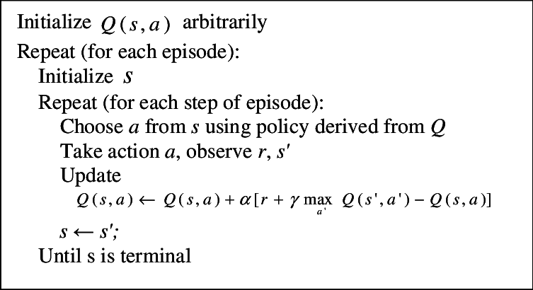

# OpenAI Gym Mountain Car Machine Learning
Implemented using [Q-Learning](https://en.wikipedia.org/wiki/Q-learning)
# References
### Q-Learning Equations

### Q-Learning Pseudocode

Code was originally created during CSCI 3482: Artificial Intelligence at [Saint Mary's University](https://smu.ca)
